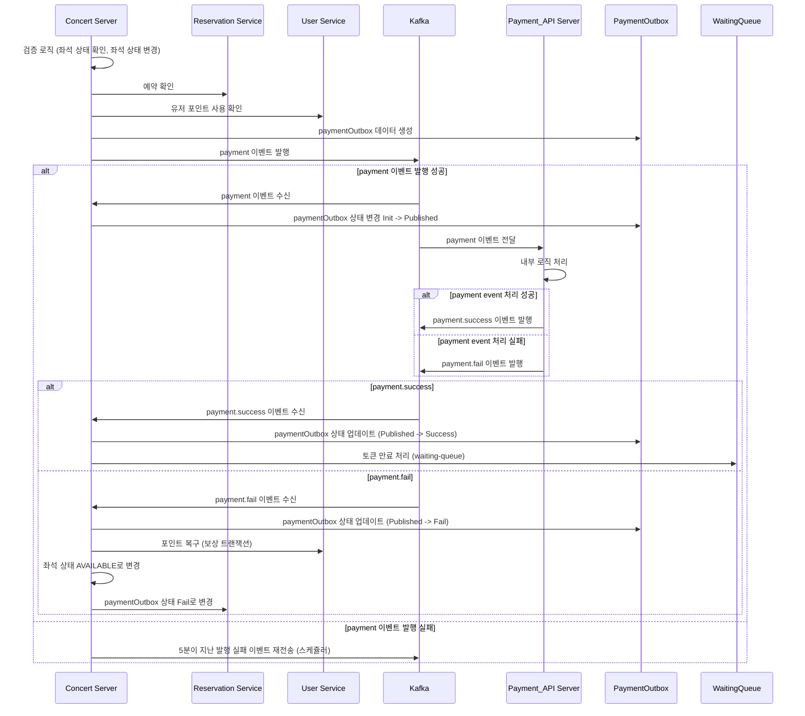

# Payment API 시퀀스 및 Outbox Pattern & Retry 로직 적용

## 1. Payment API 시퀀스



### 설명.

1. 초기 검증 및 예약 처리

- 좌석 검증 로직 (좌석 상태 확인 및 상태 변경)
- 예약 확인
- 유저 포인트 차감
- paymentOutbox 생성 및 이벤트 발행

2. 결제 이벤트 처리 흐름

- payment event 발행 성공 시.
  - Concert Server 에서 paymentOutbox 상태 변경 (Init -> Published)
  - Payment API Server 에서 payment event 수신 및 처리
  - 결제 성공 : payment.success 이벤트 발행
    - Concert Server 에서 payment.success 이벤트 수신 후 처리
  - 결제 실패 : payment.fail 이벤트 발행
    - Concert Server 에서 payment.fail 이벤트 수신 후 보상 트랜잭션 실행
- payment event 발행 실패 시.
  - Concert Server 에서 스케줄러로 발행 실패한 이벤트들 재 발행

---

## 2. Payment Event 발행 및 Outbox Pattern 적용

- Application Layer 의 Reservation Facade 의 createPayment 에서 사용
- this.kafkaClient.emit() 으로 이벤트 발행 (수신을 대기하지 않고 보내고 땡 처리)

### createPayment (비즈니스 로직 및 이벤트 발행) 구현

```ts
async createPayment(
    token: string,
    userId: number,
    seatId: number,
  ): Promise<void> {
    let seat: Seat;
    let reservation: Reservation;

    console.log('createPayment Execute');
    await this.entityManager.transaction(async (manager) => {
      // 1. 좌석 상태 확인
      seat = await this.concertService.checkSeatStatusBySeatId(
        seatId,
        'HOLD',
        manager,
      );
      // 2. 좌석 상태 변경
      seat.status = 'RESERVED';
      await this.concertService.updateSeat(seat.id, seat, manager);

      // 3. 예약 확인
      reservation =
        await this.reservationService.getReservationByUserIdAndSeatId(
          userId,
          seatId,
          manager,
        );

      // 4. 유저 포인트 사용
      await this.userService.usePoint(userId, seat.price, manager);

      // SAVE META DATA
      const metadata: IPaymentOutboxMetadata = {
        userId: userId,
        token: token,
        price: seat.price,
        reservationId: reservation.id,
        seatId: seat.id,
      };

      // 5. 결제 이벤트 Outbox Data 저장
      console.log('createPaymentOutbox Execute');
      const paymentOutbox = await this.reservationService.createPaymentOutbox(
        metadata,
        manager,
      );

      console.log('emit payment event');

      // 6. 결제 이벤트 발행
      this.kafkaClient
        .emit('payment', {
          key: `payment_reservation_${reservation.id}`,
          value: {
            eventId: paymentOutbox.id,
            // metadata,
          },
        })
        .pipe(timeout(5000));
    });

    return;
  }
```

---

### 이벤트 발행 보장을 위한 Handler 구현

- payment 구독
- Reservation Controller 에 구현

```ts
@MessagePattern('payment')
  async paymentReply(data: PaymentOutboxRequestCommonDto) {
    const { eventId } = data;
    console.log('payment received Execute', data);
    this.reservationFacade.InvokePaymentReply(
      eventId,
      PaymentOutboxStatus.PUBLISHED,
    );
  }
```

- InvokePaymentReply
- Reservation Facade 에 구현 (paymentOutbox 상태 업데이트 Init -> Published)

```ts
async InvokePaymentReply(id: number, status: PaymentOutboxStatus) {
await this.reservationService.updatePaymentOutboxStatus(id, status);
}
```

---

### Payment 성공 이벤트 Handler 구현

- payment.success 구독
- Reservation Controller 에 구현

```ts
  @MessagePattern('payment.success')
  async paymentSuccess(data: PaymentOutboxRequestCommonDto) {
    const { eventId } = data;
    console.log('paymentSuccess Execute', 'data : ', data);
    this.reservationFacade.InvokePaymentSucess({
      eventId,
      status: PaymentOutboxStatus.SUCCESS,
    });
    return data;
  }
```

- InvokePaymentSuccess
- Reservation Facade 에 구현 (성공 후 처리)

```ts
 async InvokePaymentSucess(props: {
    eventId: number;
    status: PaymentOutboxStatus;
  }) {
    const { eventId, status } = props;

    await this.entityManager.transaction(async (manager) => {
      const { token } = (
        await this.reservationService.getPaymentOutboxById(eventId, manager)
      )?.metadata;
      await this.reservationService.updatePaymentOutboxStatus(
        eventId,
        status,
        manager,
      );

      this.waitingQueueService.expireToken(token);
      // + alarm,,, slack,,,
    });
  }
```

---

### Payment 실패 이벤트 Handler 구현

- payment.fail 구독
- Reservation Controller 에 구현

```ts
 @MessagePattern('payment.fail')
  async paymentFail(data: PaymentOutboxRequestCommonDto) {
    const { eventId } = data;
    console.log('paymentFail Execute', 'data : ', data);
    this.reservationFacade.InvokePaymentFail({
      eventId: eventId,
    });
    return data;
  }
```

- InvokePaymentFail
- Reservation Facade 에 구현 (보상 트랜잭션 실행)

```ts
async InvokePaymentFail(props: { eventId: number }) {
    const { eventId } = props;
    await this.entityManager.transaction(async (manager) => {
      const { userId, price, seatId } = (
        await this.reservationService.getPaymentOutboxById(eventId, manager)
      )?.metadata;

      // 1. 유저 포인트 복구
      await this.userService.refundPoint(userId, price, manager);

      // 2. 좌석 상태 변경
      let seat = await this.concertService.getSeat(seatId, manager);
      seat.status = 'AVAILABLE';
      await this.concertService.updateSeat(seatId, seat, manager);

      // 3. 결제 이벤트 상태 변경
      await this.reservationService.updatePaymentOutboxStatus(
        eventId,
        PaymentOutboxStatus.FAIL,
        manager,
      );
    });
  }
```

---

### Payment 발행 실패 이벤트 스케줄러 구현

- retryFailedPublishPayment
- Reservation Facade 에 구현

```ts
@Cron('0 */3 * * * *')
async retryFailedPublishPayment() {
    const failedEvents =
        await this.reservationService.getAllPaymentOutboxsByStatus(
        PaymentOutboxStatus.INIT,
        );

    if (failedEvents.length === 0) return;

    // 이벤트 재전송
    for (const event of failedEvents) {
        // 5분 이상 지난 이벤트만 재전송
        if (event.createdAt.getTime() + 1000 * 60 * 5 <= new Date().getTime()) {
        this.kafkaClient
            .emit('payment', {
            key: `payment_reservation_${event.metadata.reservationId}`,
            value: {
                eventId: event.id,
                metadata: event.metadata,
            },
            })
            .pipe(timeout(5000));
        }
    }
}
```
