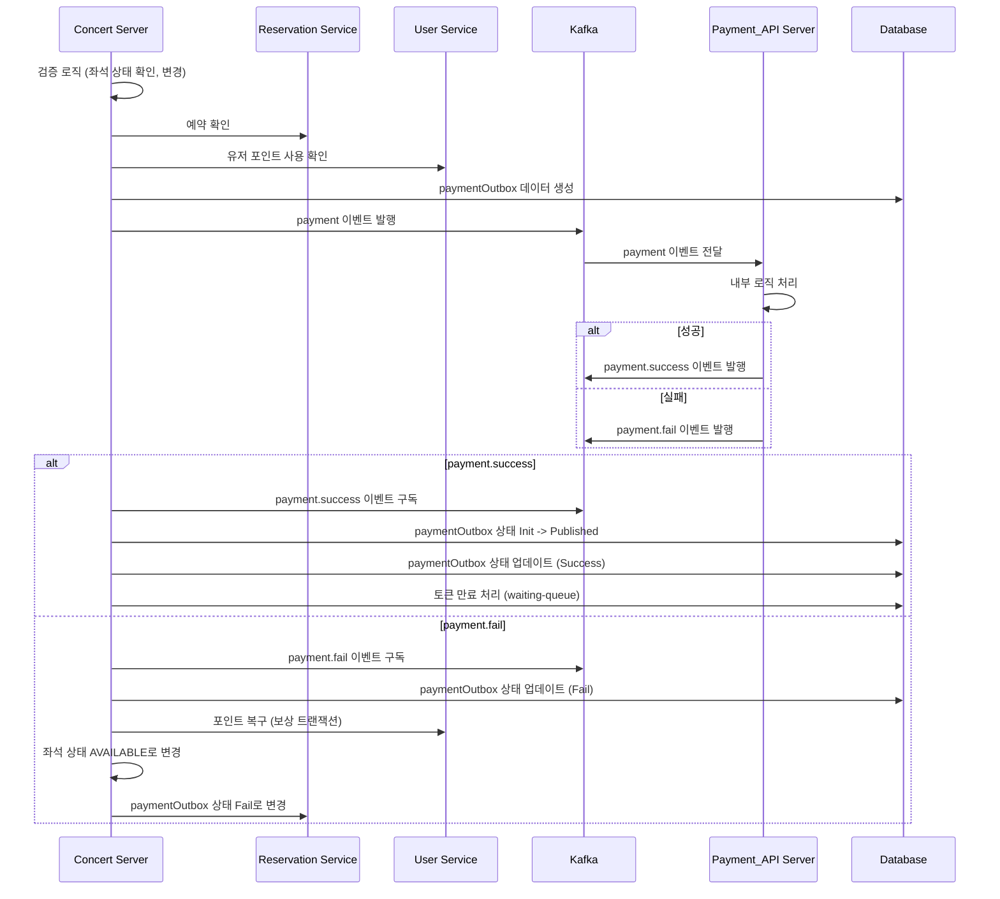

## Payment API 실행 시, 시퀀스

```mermaid
sequenceDiagram
    participant Concert as Concert Server
    participant Reservation as Reservation Service
    participant User as User Service
    participant Kafka as Kafka
    participant PaymentAPI as Payment_API Server
    participant DB as Database

    Concert->>Concert: 검증 로직 (좌석 상태 확인, 변경)
    Concert->>Reservation: 예약 확인
    Concert->>User: 유저 포인트 사용 확인
    Concert->>DB: paymentOutbox 데이터 생성
    Concert->>Kafka: payment 이벤트 발행

    Kafka->>PaymentAPI: payment 이벤트 전달
    PaymentAPI->>PaymentAPI: 내부 로직 처리
    alt 성공
        PaymentAPI->>Kafka: payment.success 이벤트 발행
    else 실패
        PaymentAPI->>Kafka: payment.fail 이벤트 발행
    end

    alt payment.success
        Concert->>Kafka: payment.success 이벤트 구독
        Concert->>DB: paymentOutbox 상태 Init -> Published
        Concert->>DB: paymentOutbox 상태 업데이트 (Success)
        Concert->>DB: 토큰 만료 처리 (waiting-queue)
    else payment.fail
        Concert->>Kafka: payment.fail 이벤트 구독
        Concert->>DB: paymentOutbox 상태 업데이트 (Fail)
        Concert->>User: 포인트 복구 (보상 트랜잭션)
        Concert->>Concert: 좌석 상태 AVAILABLE로 변경
        Concert->>Reservation: paymentOutbox 상태 Fail로 변경
    end
```
